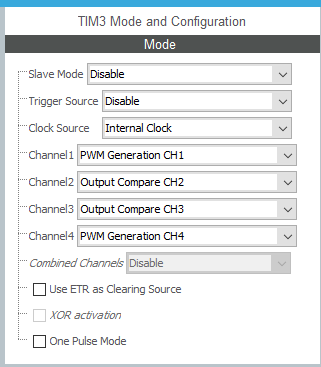
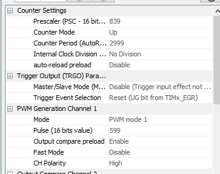
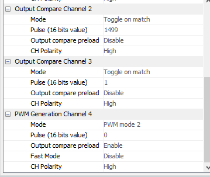

oiiiiiiiiiii outra hora eu termino de comentar tudo!!!!!!!! prometo só preciso q alguem me lembre

private variables:
```c
int ch2_ccr[4] = {1499, 1699, 1899, 2099}; // define as bordas de subida/descida dos pulsos do canal 2 (200 ARR = 2ms)
int ch2_atu = 0; // posicao atual no vetor de cima (qual a borda atual)

float ch3_inicio = 0; // quando o ch3 tem q começar (nao pode ser maior que o arr...)
int ch3_ativo = 0; // 0 se a saida estiver em low, 1 se a saida estiver em high (pra saber se o próximo ccr precisa ser o de inicio ou o de sinal do sinal)
```

main:
```c
  HAL_TIM_PWM_Start_IT(&htim3, TIM_CHANNEL_1); // inicia o canal 1 do tim 3 em pwm
  HAL_TIM_OC_Start_IT(&htim3, TIM_CHANNEL_2);  // inicia o canal 2 do tim 3 em oc
  HAL_TIM_OC_Start_IT(&htim3, TIM_CHANNEL_3);  // inicia o canal 3 do tim 3 em oc
  HAL_TIM_PWM_Start_IT(&htim3, TIM_CHANNEL_4); // inicia o canal 4 do tim 3 em pwm
```

interrupção:
```c
void HAL_TIM_OC_DelayElapsedCallback(TIM_HandleTypeDef *htim){
		if(htim->Channel == HAL_TIM_ACTIVE_CHANNEL_2){
			ch2_atu++;
			if(ch2_atu > 3) ch2_atu = 0;

			__HAL_TIM_SET_COMPARE(&htim3, TIM_CHANNEL_2, ch2_ccr[ch2_atu]);
		}

		if(htim->Channel == HAL_TIM_ACTIVE_CHANNEL_3){
			if(ch3_ativo == 1){
				ch3_inicio = ch3_inicio + 44;
				if(ch3_inicio > 2500) ch3_inicio = 0;
				__HAL_TIM_SET_COMPARE(&htim3, TIM_CHANNEL_3, ch3_inicio);

				__HAL_TIM_SET_COMPARE(&htim3, TIM_CHANNEL_4, 2520 - ch3_inicio);

				ch3_ativo = 0;
			}

			else{
				__HAL_TIM_SET_COMPARE(&htim3, TIM_CHANNEL_3, ch3_inicio+400);

				ch3_ativo = 1;
			}
		}
}
```


- (ativar interrupção do timer)  
    
  

