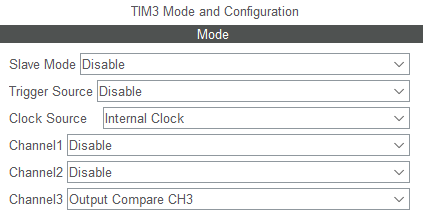
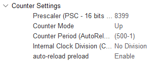
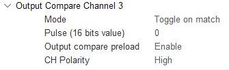

(só tem uma linha de código, que é pra iniciar o canal)
- `HAL_TIM_OC_Start_IT(&htim3, TIM_CHANNEL_3);`

8400 (PSC) * 500 (ARR) / 84000000hz (system freq) = 0,05s
a cada 0,05s, o pino inverte sua saída (um ciclo de 0,1s ou 10hz com 50% de duty cycle)

