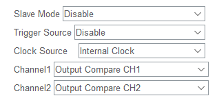
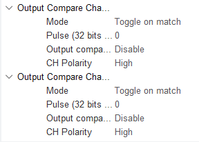

main:
```
  HAL_TIM_OC_Start_IT(&htim2, TIM_CHANNEL_1);
  HAL_TIM_OC_Start_IT(&htim2, TIM_CHANNEL_2);
```

interrupção:
```
void HAL_TIM_OC_DelayElapsedCallback(TIM_HandleTypeDef *htim){
	if(htim->Instance == TIM2){
		if(htim->Channel == HAL_TIM_ACTIVE_CHANNEL_1){
			if(__HAL_TIM_GET_COMPARE(&htim2, TIM_CHANNEL_1) == 0)
				__HAL_TIM_SET_COMPARE(&htim2, TIM_CHANNEL_1, 249);
			else
				__HAL_TIM_SET_COMPARE(&htim2, TIM_CHANNEL_1, 0);
		}
	}
}
```


191 * 500 / 84000000 = 0,00113s ou 880hz


- (ativar interrupção)



