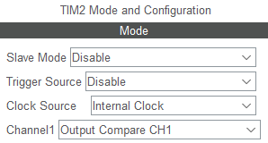
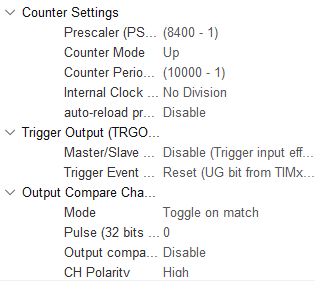

main:
```
  HAL_TIM_OC_Start_IT(&htim2, TIM_CHANNEL_1);
```

interrupção:
```c
void HAL_TIM_OC_DelayElapsedCallback(TIM_HandleTypeDef *htim){
	if(htim->Instance == TIM2){
		if(htim->Channel == HAL_TIM_ACTIVE_CHANNEL_1){
			if(__HAL_TIM_GET_COMPARE(&htim2, TIM_CHANNEL_1) < 700)
			// ([subida] & [descida]) 0 & 10, 20 & 30, 40 & 50, 60 & 70
				__HAL_TIM_SET_COMPARE(&htim2, TIM_CHANNEL_1, __HAL_TIM_GET_COMPARE(&htim2, TIM_CHANNEL_1)+100);
			else
				__HAL_TIM_SET_COMPARE(&htim2, TIM_CHANNEL_1, 0);
		}
	}
}
```

8400 * 10000 / 84000000 = ciclo de 1s


- (ativar interrupção)  
    
  
