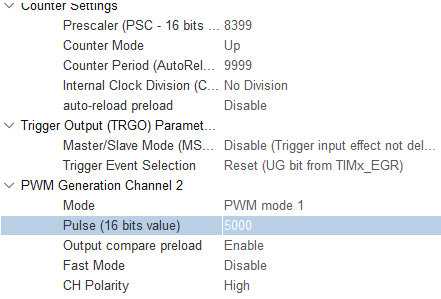

privates variables:
```c
#define TOUT 1000
#define TMSG 200
uint8_t msg[TMSG]="\r\n\ntui ledzinho rgb";
HAL_StatusTypeDef status;

#define TCMD 1
uint8_t comando[TCMD];
double duty_cicle = 0.5;
```

main:
```c
  HAL_TIM_Base_Start_IT(&htim3);
  HAL_TIM_PWM_Start_IT(&htim3, TIM_CHANNEL_2);

  HAL_UART_Transmit(&huart2, msg, strlen(msg), TOUT);
  msg[0]='\0';

  HAL_UART_Receive_IT(&huart2, comando, TCMD);
```

while:
```c
if (msg[0]!='\0'){
		HAL_UART_Transmit(&huart2, msg, strlen(msg), TOUT);
			msg[0]='\0';
	  }
```

funcoes:
```c
void HAL_UART_RxCpltCallback(UART_HandleTypeDef *huart)
{

	if(comando[0] >= '0' && comando[0] <= '9'){
		int param = comando[0];

		duty_cicle = comando[0]-'0';
		duty_cicle /= 10;

		sprintf(msg,"\r\nduty cicle alterado para 0.%i", ((int)(comando[0])-48));
	}

	else{
		sprintf(msg,"\r\nnao entendi kkk %i", comando[0]-'0');
	}

	 HAL_UART_Receive_IT(&huart2, comando, TCMD);
}

void HAL_TIM_PWM_PulseFinishedCallback(TIM_HandleTypeDef *htim){
	sprintf(msg,"\r\nfinished %c", comando[0]);
}

void HAL_TIM_PeriodElapsedCallback(TIM_HandleTypeDef *htim)
{
	__HAL_TIM_SET_COMPARE(&htim3, TIM_CHANNEL_2, __HAL_TIM_GET_AUTORELOAD(&htim3)*duty_cicle);
	sprintf(msg,"\r\narr/ccr %i %i", __HAL_TIM_GET_AUTORELOAD(&htim3), __HAL_TIM_GET_COMPARE(&htim3, TIM_CHANNEL_2));
	HAL_GPIO_TogglePin(LD2_GPIO_Port, LD2_Pin);
}

```


- (ativar interrupção e configurar USART)  
    
  
