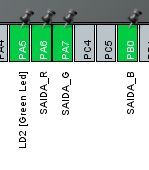
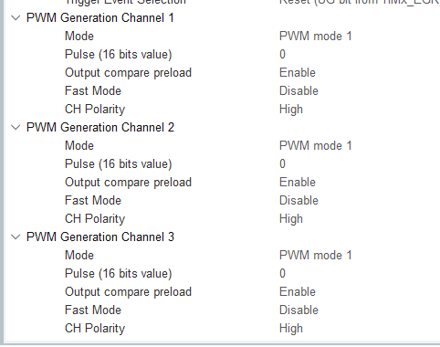

privates variables:
```c
#define TOUT 1000
#define TMSG 200
uint8_t msg[TMSG]="\r\n\ntui ledzinho rgb";
HAL_StatusTypeDef status;

#define TCMD 2
uint8_t comando[TCMD];
double duty_cicle[3] = { 0.5 , 0.5 , 0.5 };
```

main:
```c
  HAL_TIM_Base_Start_IT(&htim3);
  HAL_TIM_PWM_Start_IT(&htim3, TIM_CHANNEL_1);
  HAL_TIM_PWM_Start_IT(&htim3, TIM_CHANNEL_2);
  HAL_TIM_PWM_Start_IT(&htim3, TIM_CHANNEL_3);

  HAL_UART_Transmit(&huart2, msg, strlen(msg), TOUT);
  msg[0]='\0';

  HAL_UART_Receive_IT(&huart2, comando, TCMD);
```

while:
```c
if (msg[0]!='\0'){
		HAL_UART_Transmit(&huart2, msg, strlen(msg), TOUT);
			msg[0]='\0';
	  }
```

funcoes:
```c
void HAL_UART_RxCpltCallback(UART_HandleTypeDef *huart)
{
	comando[0] = toupper(comando[0]);


	if(comando[1] >= '0' && comando[1] <= '9' && (comando[0] == 'R' || comando[0] == 'G' || comando[0] == 'B')){
		int cor;
		switch(comando[0]){
		case 'R': cor = 0; break;
		case 'G': cor = 1; break;
		case 'B': cor = 2; break;
		}

		duty_cicle[cor] = (10)-(comando[1]-'0');
		duty_cicle[cor] /= 10;

		sprintf(msg,"\r\nduty cicle %i alterado para 0.%i", cor, ((int)(comando[1])-48));
	}

	else{
		sprintf(msg,"\r\nn entendi kkk %c%c", comando[0], comando[1]);
	}

	 HAL_UART_Receive_IT(&huart2, comando, TCMD);
}

void HAL_TIM_PeriodElapsedCallback(TIM_HandleTypeDef *htim)
{
	__HAL_TIM_SET_COMPARE(&htim3, TIM_CHANNEL_1, __HAL_TIM_GET_AUTORELOAD(&htim3)*duty_cicle[0]);
	__HAL_TIM_SET_COMPARE(&htim3, TIM_CHANNEL_2, __HAL_TIM_GET_AUTORELOAD(&htim3)*duty_cicle[1]);
	__HAL_TIM_SET_COMPARE(&htim3, TIM_CHANNEL_3, __HAL_TIM_GET_AUTORELOAD(&htim3)*duty_cicle[2]);
}
```


- (ativar interrupção e configurar USART)  
    
      
  
