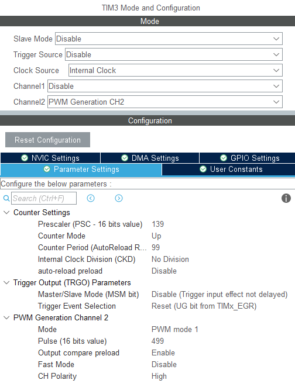

(vc precisa mudar a frequência do timer e a variável 'tamanho' de acordo com a frequência que vc quer a onda senoidal

includes:
```c
#include <math.h>
```

privates variables:
```c
	int tamanho = 6000;
	int ponto = 0;
```

main:
```c
  HAL_TIM_Base_Start_IT(&htim3);
  HAL_TIM_PWM_Start_IT(&htim3, TIM_CHANNEL_2);
```

funcoes:
```c
void HAL_TIM_PeriodElapsedCallback(TIM_HandleTypeDef *htim)
{
	__HAL_TIM_SET_COMPARE(&htim3, TIM_CHANNEL_2, __HAL_TIM_GET_AUTORELOAD(&htim3)*(sin(ponto*2*M_PI / tamanho)));

	sprintf(&msg, "\r\n%i: %i", ponto, __HAL_TIM_GET_COMPARE(&htim3, TIM_CHANNEL_2));

	ponto++;
	if(ponto >= tamanho)
		ponto = 0;
}
```


- (ativar interrupção)   
      
